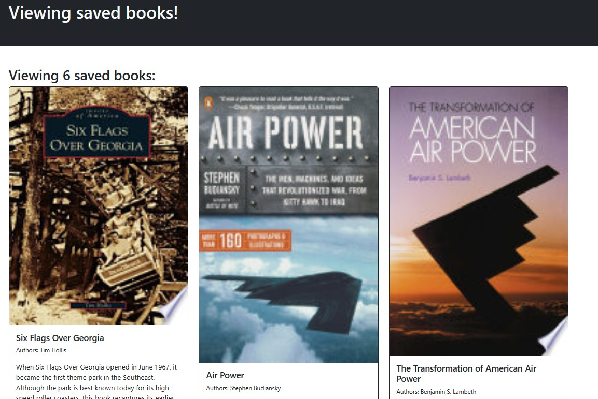

# Book-Search

## License

## Description

This project is to take the starter code with a fully functioning Google Books API search engine built with a RESTful API, and refactor it to be a GraphQL API built with Apollo Server. The application was built using the MERN stack with a React front end, MongoDB database, Node.js, Express.js and API and was already set up to allow the users to save book searches to the back end.

This project assisgnment is to :

Set up an Apollo Server to use GraphQL queries and muations to fetch and modify data, replacing the existing RESTful API.
Modify the existing authenication middleware so that it works in the context of a GraphQL API.
Create an Apollo Provider so that requests can communicate with an Apollo Server.
Deploy the application to Heroku with a MongoDB database using MongoDB Atlas.
## Screenshot

## Techonolgies Used
This application is a MERN stack application which is a group of four technologies, that is:-

1. MongoDB
2. Express.js
3. ReactJS
4. Node.js
## Link

GitHub Repo: https://github.com/DenCoding2023/Book-Search.git

Heroku Deployment: Heroku is giving me an issue. It wont build. I have spend 2
days and with AskBCS and it keeps asking having an issue with vite to build. 

## References

1. compare used as resource: https://github.com/auswaller/Book-Lookup.git
2. compare used as resource: https://github.com/stellalph/21-MERN-Book-Search-Engine.git
2. Video Guide: https://youtu.be/AxdSYjon_Fc?si=GyMxzTiMjh0sx0VH
3. Assitance from Adress Jimenes from Calendy tutors. 